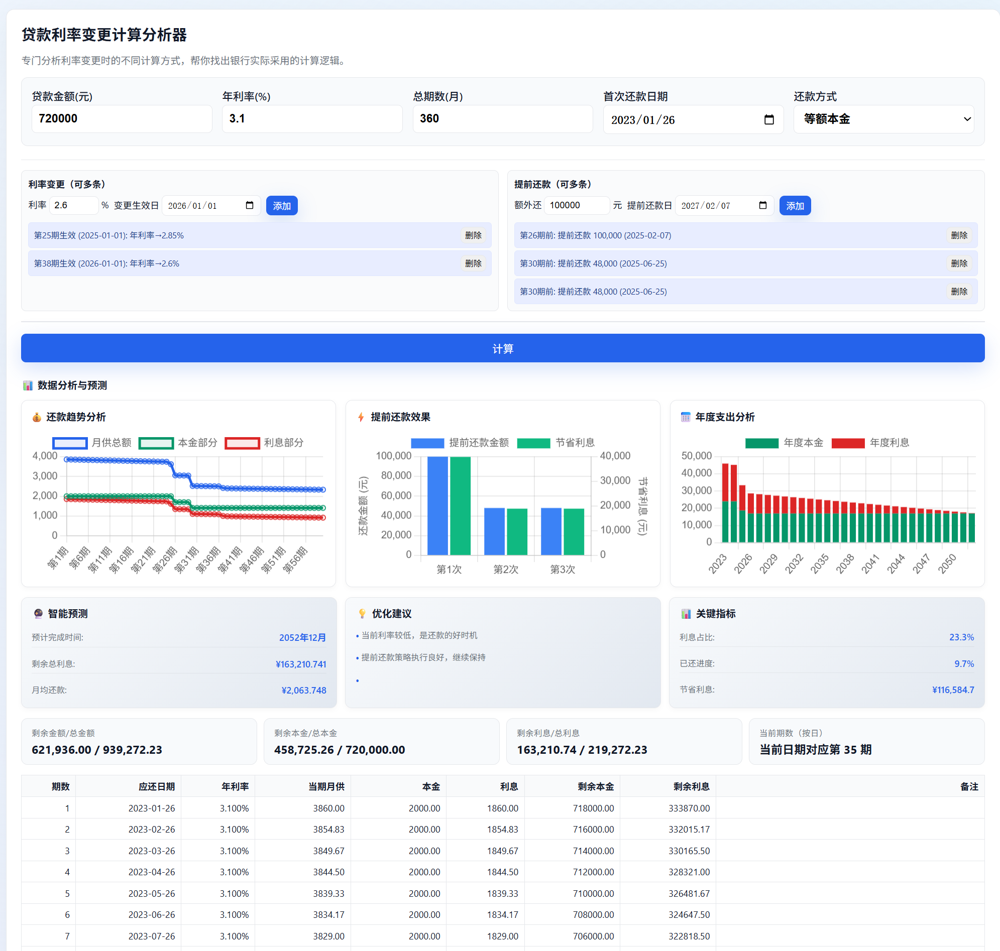

# Loans Landing Page

静态的贷款主题着陆页，可直接通过浏览器打开 `index.html` 查看，也可使用 Docker 部署在任意服务器上。

## 快速开始

```bash
# 本地直接打开
open index.html
```

```bash
# Docker 部署
docker build -t loans .
docker run --rm -p 8080:80 loans
# 浏览器访问 http://localhost:8080
```

## 页面预览



## 产品说明

  仅支持 **等额本金** 还款方式   
- **提取还款** 场景仅支持「期数不变、月供减少」的模式

## 证书 / License

本项目使用 Public Domain（CC0）证书，完全没有任何限制，可自由复制、修改、分发及用于商业用途。

